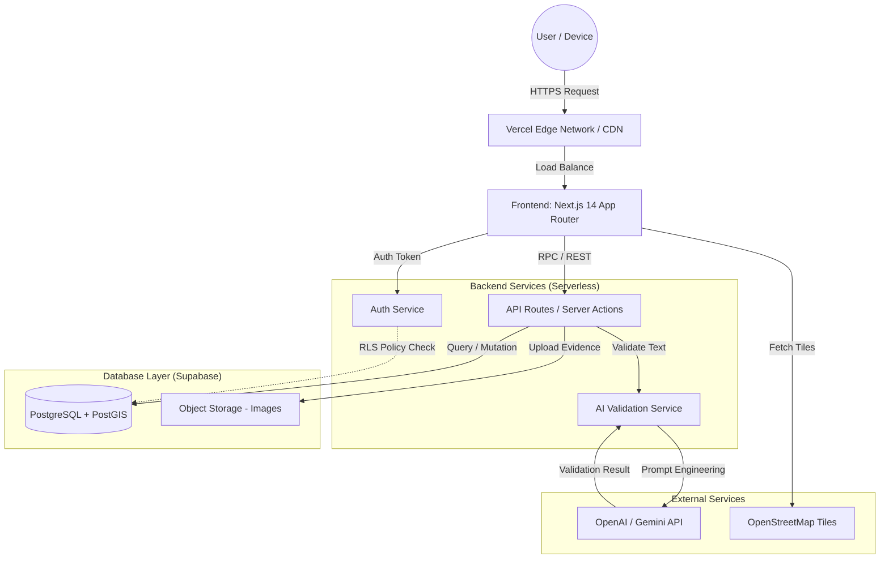
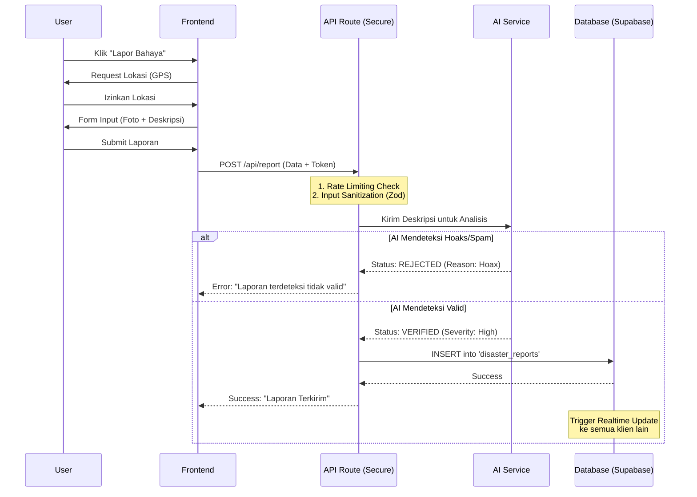

# SPKL: Jalur Aman - Platform Evakuasi Bencana

**Versi Dokumen:** 1.0 (MVP Hackathon Edition)
**Status:** Draft Final
**Pengembang:** [Ferry Agus Pratama]

---

## 1. Pendahuluan

### 1.1 Tujuan

Dokumen ini menjelaskan spesifikasi kebutuhan perangkat lunak untuk **Jalur Aman**, sebuah platform berbasis web (PWA) yang dirancang untuk meningkatkan kesiapsiagaan bencana melalui partisipasi masyarakat (_crowdsourcing_) yang diverifikasi oleh Artificial Intelligence (AI) dan analisis geospasial real-time.

### 1.2 Cakupan Produk

Jalur Aman mencakup fitur peta interaktif, pelaporan bencana berbasis lokasi, validasi hoaks otomatis menggunakan LLM (Large Language Model), dan penentuan rute evakuasi dinamis menggunakan algoritma geospasial.

### 1.3 Definisi & Istilah

- **MVP:** Minimum Viable Product.
- **PWA:** Progressive Web App (Aplikasi web yang bisa berjalan offline).
- **RLS:** Row Level Security (Fitur keamanan database PostgreSQL).
- **PostGIS:** Ekstensi database untuk pengolahan data geografis.
- **LLM:** Large Language Model (AI untuk pemrosesan teks).

---

## 2. Arsitektur Sistem

Sistem menggunakan arsitektur **Modern Serverless** untuk memastikan skalabilitas tinggi saat terjadi lonjakan trafik bencana, dengan keamanan data sebagai prioritas utama.

### 2.1 Diagram Arsitektur (High-Level)

_Diagram ini menggambarkan aliran data dari klien hingga ke database dan layanan pihak ketiga._



### 2.2 Tech Stack

| Komponen       | Teknologi                       | Alasan Pemilihan                                            |
| -------------- | ------------------------------- | ----------------------------------------------------------- |
| **Frontend**   | Next.js 16, React, Tailwind CSS | Rendering cepat, SEO friendly, ekosistem Vercel.            |
| **UI Library** | shadcn/ui                       | Komponen aksesibel, konsisten, dan modern.                  |
| **Maps**       | Leaflet.js, React-Leaflet       | Open-source, ringan, tidak bergantung pada Google Maps API. |
| **Backend**    | Supabase (BaaS)                 | Database real-time, Auth built-in, Skalabilitas instan.     |
| **Database**   | PostgreSQL + PostGIS            | Standar industri untuk data geospasial kompleks.            |
| **AI Engine**  | Vercel AI SDK (OpenAI/Gemini)   | Integrasi stream response yang mudah untuk validasi teks.   |

---

## 3. Alur Proses (Flowchart)

### 3.1 Flowchart: Pelaporan Bencana & Validasi AI

_Proses ini memastikan data yang masuk bersih dari spam, hoaks, dan konten berbahaya sebelum ditampilkan ke publik._



---

## 4. Kebutuhan Fungsional (Functional Requirements)

### FR-01: Manajemen Pengguna & Otentikasi

- **FR-01-01:** Pengguna dapat mendaftar menggunakan Email atau Google OAuth.
- **FR-01-02:** Sistem menerapkan sesi login persisten (JWT) yang aman.
- **FR-01-03:** Pengguna memiliki "Trust Score" yang bertambah setiap laporan valid (+5) dan berkurang jika hoaks (-10).

### FR-02: Peta Interaktif & Geospasial

- **FR-02-01:** Sistem menampilkan peta dasar (base map) dari OpenStreetMap.
- **FR-02-02:** Sistem merender _Heatmap_ atau _Cluster Marker_ untuk area dengan densitas laporan tinggi.
- **FR-02-03:** Sistem dapat menghitung jarak _Euclidean_ (garis lurus) dan rute jalan raya (via OSRM/GraphHopper) dari lokasi user ke posko terdekat.

### FR-03: Pelaporan Bencana (Crowdsourcing)

- **FR-03-01:** Pengguna hanya dapat melapor jika GPS aktif (Geo-fencing: User tidak bisa memalsukan lokasi pelaporan lebih dari 100m dari posisi asli).
- **FR-03-02:** Formulir pelaporan mencakup: Jenis Bencana, Foto Bukti, dan Deskripsi Singkat.
- **FR-03-03:** Foto yang diunggah otomatis dikompresi dan metadata EXIF sensitif dihapus.

### FR-04: Kecerdasan Buatan (AI Validation)

- **FR-04-01:** Sistem menggunakan NLP untuk klasifikasi sentimen dan fakta pada deskripsi laporan.
- **FR-04-02:** AI menentukan tingkat keparahan (Severity Level 1-5) berdasarkan kata kunci (contoh: "air setinggi dada" = Level 4).

---

## 5. Kebutuhan Non-Fungsional (Enterprise Grade)

### 5.1 Keamanan (Security)

- **Enkripsi:** Semua data sensitif dienkripsi _at-rest_ (AES-256) dan _in-transit_ (TLS 1.3).
- **RLS (Row Level Security):** Kebijakan database memastikan pengguna hanya bisa mengedit/menghapus laporan milik mereka sendiri.
- **Anti-Abuse:** Rate limiting diterapkan pada endpoint API (maks 10 laporan/jam per user).

### 5.2 Kinerja (Performance)

- **Latency:** Respon API < 200ms untuk query peta standar.
- **Concurrency:** Sistem dirancang untuk menangani hingga 1.000 concurrent users pada fase MVP menggunakan _Connection Pooling_.

### 5.3 Ketersediaan (Availability)

- **Offline-First:** Aplikasi menggunakan Service Workers untuk menyimpan _cache_ peta dasar, sehingga aplikasi tetap bisa dibuka (read-only) saat internet mati total.

---

## 6. Desain Database (Schema Highlights)

Berikut adalah struktur tabel inti yang dioptimalkan untuk performa PostGIS.

```sql
-- Tabel Laporan Bencana
CREATE TABLE disaster_reports (
  id UUID DEFAULT gen_random_uuid() PRIMARY KEY,
  user_id UUID REFERENCES auth.users(id) ON DELETE CASCADE,
  location GEOGRAPHY(Point, 4326) NOT NULL, -- Spasial Index aktif
  disaster_type VARCHAR(50) NOT NULL,
  description TEXT,
  severity_level INT CHECK (severity_level BETWEEN 1 AND 5),
  status VARCHAR(20) DEFAULT 'PENDING_AI', -- PENDING_AI, VERIFIED, REJECTED
  ai_confidence_score FLOAT, -- Skor keyakinan AI (0.0 - 1.0)
  created_at TIMESTAMPTZ DEFAULT NOW()
);

-- Index Spasial (Wajib untuk performa peta)
CREATE INDEX disaster_reports_geo_idx ON disaster_reports USING GIST (location);

```

---

## 7. Rencana Pengembangan (Roadmap)

1. **Fase 1 (Hari 1-2):** Setup Project, Database Schema, Auth, dan Integrasi Peta Dasar.
2. **Fase 2 (Hari 3-4):** Implementasi CRUD Laporan, Upload Foto, dan Realtime Subscriptions.
3. **Fase 3 (Hari 5):** Integrasi AI Validation, Logic Rute Evakuasi Sederhana.
4. **Fase 4 (Hari 6):** UI Polish, Dark Mode, Testing, dan Deployment.

---
